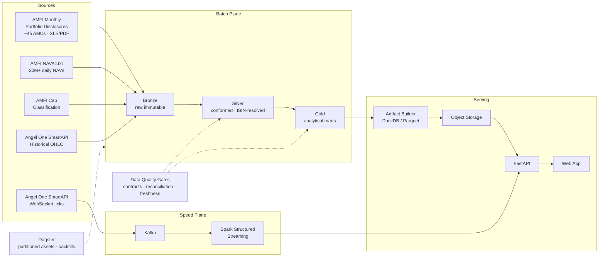

<div align="center">

# FundXRay

**You think you own 7 mutual funds. You own HDFC Bank.**

A transparency layer over India's ₹82 lakh crore mutual fund industry — built on public SEBI-mandated disclosures and live market data.

[]()
[]()
[]()
[]()
[]()

[Live Demo](#) · [Architecture](docs/architecture.md) · [Metric Definitions](docs/metrics.md) · [Benchmarks](docs/benchmarks.md)

</div>

---

## The problem

India has **9.64 crore active SIP accounts** and **27.66 crore folios** holding **₹82.22 lakh crore** in mutual funds *(AMFI, June 2026)*. Almost none of those investors can answer three basic questions about their own money.

**1. What do I actually own?**
Large-cap, flexi-cap and multi-cap funds all fish from the same Nifty 100 pool. Hold six funds and you may still have 11% of your net worth in a single bank — hidden concentration wearing the costume of diversification, and you're paying six expense ratios for it.

**2. What am I really paying?**
A one-percentage-point expense ratio difference costs roughly **₹11 lakh** on a ₹10,000 monthly SIP over 20 years. Some "active" funds overlap 88% with their benchmark while charging 1.75% for the privilege.

**3. Is this fund doing what its name says?**
SEBI defines the categories. AMFI publishes the official large/mid/small-cap list twice a year. Style drift is objectively measurable — and never shown to the people it affects.

**The answers are already public.** SEBI mandates that every AMC publish complete scheme holdings monthly, free of charge. The data has simply never been assembled — because doing so means parsing a decade of inconsistent Excel and PDF files from ~45 asset managers and resolving millions of messy company names to stable identities.

That gap between *public* and *usable* is what this project closes.

---

## What FundXRay does

| Feature | What it answers |
|---|---|
| **Look-through X-Ray** | Your whole portfolio dissolved into real stock-level weights — not pairwise fund overlap |
| **Closet Index Detector** | Active share vs. benchmark, priced against the expense ratio you actually pay |
| **Style Drift Monitor** | Month-by-month cap composition vs. what the category permits |
| **Fee Drag Calculator** | Direct vs. regular, in rupees on your holdings, over your horizon |
| **Inferred Turnover** | Portfolio churn derived from month-over-month holdings deltas |
| **Days-to-Liquidate** | How long funds would need to exit a position at realistic volume — *the crowding metric nobody publishes* |
| **Live Mark-to-Market** | Your true underlying exposure, revalued in real time |

### The differentiator

Existing overlap tools compare **2–3 funds at today's snapshot**. FundXRay analyses the **entire portfolio across the full monthly history**, and fuses holdings data with live market microstructure.

**Days-to-Liquidate** is the flagship metric and only exists because of that fusion: combine aggregate mutual fund ownership of a stock (from SEBI disclosures) with its average daily traded volume (from Angel One SmartAPI), and you can estimate how many trading days the industry would need to exit — at 20% of ADV — without moving the price. When funds collectively own too much of an illiquid mid-cap, they are all standing at the same exit. This is an institutional-grade risk measure, computable entirely from free public data, and absent from every consumer-facing Indian tool.

---

## Architecture



**Why heavy compute never touches the hosting bill:** Spark runs offline over the full history and publishes a compacted artifact (tens of MB for the entire industry) to object storage. The API loads it and resolves any user's portfolio in milliseconds. Users get instant answers; serving cost stays at zero.

---

## Data sources

| Source | Contents | Access |
|---|---|---|
| AMFI Monthly Portfolio Disclosures | Complete holdings, every scheme, monthly — SEBI mandated | Free, public |
| AMFI `NAVAll.txt` | Daily NAV, entire industry | Free, no auth |
| AMFI Cap Classification | Official large/mid/small-cap list, published half-yearly | Free, public |
| Angel One SmartAPI — Historical | OHLCV candles for risk metrics, beta, ADV | Free with account |
| Angel One SmartAPI — WebSocket | Live ticks for real-time portfolio marking | Free with account |

> Credentials are never committed. See [`.env.example`](.env.example). SmartAPI rate limits are respected via a token-bucket throttle in `pipelines/ingestion/angelone/`.

---

## Engineering highlights

The product is the visible half. These are the problems that made it hard.

**Heterogeneous ingestion at format scale.** ~45 AMCs, each publishing in their own Excel and PDF layouts, which have changed repeatedly over a decade. Solved with a registry of per-AMC adapters, automatic format fingerprinting, and explicit schema-drift handling — see [`docs/ingestion-adapters.md`](docs/ingestion-adapters.md).

**Entity resolution.** "HDFC Bank Ltd" / "HDFC Bank Limited" / "HDFC BANK LTD." are one company. Resolution is ISIN-first (with check-digit validation, which catches corrupted identifiers) and falls back to blocked fuzzy name matching for the legacy files that carry no ISIN column at all. Every row records its resolution method and confidence; unresolved equity rows are demoted rather than counted. Measured on the fixture suite: 100% resolution — 55 rows by ISIN, 13 by fuzzy name.

**Corporate action adjustment.** A 1:5 split multiplies share count fivefold while the position is unchanged — compute turnover on unadjusted quantities and you invent trading that never happened. Splits, bonuses and mergers are restated onto the latest basis, with successor mapping for merged entities. Weights are deliberately untouched, because a split changes neither the value of a position nor its share of net assets. The invariant is unit-tested: three observations spanning a split and a bonus must resolve to one identical adjusted position.

**Distributed computation with measured tuning.** Pairwise overlap is O(n²) in schemes, joined on a key whose distribution is brutally skewed. Benchmarked on 5.04M rows. The ranked findings — **partition pruning 10.5×, file compaction 5.4×**, shuffle tuning 1.37×, AQE 1.34×, and **manual salting measured *negative*** — say something more useful than any single number: the big wins are structural, in how data is laid out, not in configuration flags. Full method and caveats in [`docs/benchmarks.md`](docs/benchmarks.md).

**Broker sign-in without ever touching credentials.** Users sign in with Angel One to see their own holdings analysed. FundXRay never asks for — and cannot store — a PIN, password or TOTP secret. It uses Angel One's Publisher Login flow: the user authenticates on `angelone.in`, which redirects back with short-lived tokens. Those tokens live server-side only; the browser holds an opaque, HMAC-signed session id and nothing else. The `state` parameter is a single-use CSRF nonce, sessions expire at Angel One's own midnight-IST limit, and a test scans the entire repository to prove no order-placement or fund-transfer code path exists. Storing a TOTP *seed* would mean holding a permanent second factor for someone's brokerage account; that is why this design was non-negotiable.

**Privacy as a hard constraint.** A Consolidated Account Statement is somebody's entire financial position. It is parsed in memory and never written to disk; PAN, email and folio numbers are redacted *before* parsing, so they cannot reach a log line; only `{isin: value}` leaves the module. Four tests exist purely to keep that posture non-negotiable rather than aspirational.

**Cross-engine type discipline.** pandas writes nanosecond timestamps and `null`-typed columns; Spark 3.5 reads neither. Every warehouse write goes through `core/fundxray_core/io.py`, which coerces to the physical types pandas, DuckDB and Spark all accept — with `assert_spark_readable()` as a cheap CI guard.

**Correctness is non-negotiable.** A parsing bug means showing someone wrong numbers about their savings. Weights reconcile per scheme-month; unresolved holdings are demoted rather than counted; unrecognised files quarantine loudly; freshness SLAs are enforced per source. One gate exists because it caught a real bug during development — a seed calibration implied a fund held 181% of a stock's free float, which is physically impossible.

**Streaming semantics.** The tick consumer applies event-time watermarking, `dropDuplicates` within the watermark, checkpointing, and dead-letter routing. Verified: 1,119 delivered events containing injected duplicates and malformed payloads produced exactly 1,054 correct rows. The mid-stream kill/restart assertion is written but not yet green — see [`docs/streaming.md`](docs/streaming.md). It is listed as unproven rather than claimed.

### Build status — what is actually implemented

Verified by running it, not by intention. Numbers in the "Measured" column came from real executions on a 2 vCPU box; see [`docs/benchmarks.md`](docs/benchmarks.md).

| Capability | Status | Measured |
|---|---|---|
| AMFI NAV parser | ✅ shipped | parses live AMFI format incl. `-` nulls, stale dates, section headers; quarantines bad rows |
| AMC disclosure adapters | ✅ shipped | 6 adapters + generic fallback, 6 fixtures, golden tests |
| Entity resolution (ISIN + fuzzy) | ✅ shipped | 100% equity resolution on fixtures — 55 by ISIN, 13 by fuzzy name |
| Bronze → Silver pipeline | ✅ shipped | 6 files → 75 rows, 0 quarantined, provenance preserved |
| Data quality gates | ✅ shipped | 5 gates; freshness correctly fails stale partitions |
| Analytics engine (9 metrics) | ✅ shipped | unit-tested; fee drag validated against published ₹92L/₹81L illustration |
| Spark medallion (gold marts) | ✅ shipped | 4 marts built on Spark 3.5.1 |
| Apache Iceberg tables | ✅ shipped | 4 real snapshots, time travel verified (260 → 520 → 1,039 rows) |
| Dagster partitioned assets | ✅ shipped | 3/3 monthly partitions materialized in a backfill |
| Serving artifact + API + web | ✅ shipped | DuckDB artifact, 17 endpoints, p95 in-memory resolution |
| Angel One sign-in (Publisher Login) | ✅ shipped | CSRF nonce, signed HttpOnly session, midnight-IST expiry, 18 security tests |
| Personal holdings dashboard | ✅ shipped | concentration, sectors, crowding on the user's own demat holdings |
| Performance lab | ✅ all 5 benchmarks | partition pruning **10.5×**, compaction **5.4×**, shuffle tuning 1.37×, AQE 1.34×; salting measured *negative* |
| SmartAPI integration | ⚙️ code complete, unrun | needs credentials; risk maths unit-tested |
| Streaming dedup + DLQ | ✅ verified | 1,119 events → 1,054 rows; duplicates dropped, malformed dead-lettered |
| Streaming kill/restart proof | ⚠️ partially verified | kill now lands mid-stream (196/1,054 rows); restart assertions unevaluated |
| AMFI bulk downloader | ✅ shipped | content-hash cache, provenance manifest, resumable backfill *(unrun — no network here)* |
| Scheme master join | ✅ shipped | collapses plan variants; fuzzy-matches disclosure names to AMFI codes |
| Corporate actions | ✅ shipped | split/bonus/merger adjustment; 6 tests incl. same-position invariant |
| PDF adapter | ✅ shipped | pdfplumber, multi-page header carry-over |
| CAS upload | ✅ shipped | in-memory parse, PAN/email/folio redacted, 4 privacy tests |
| Deployment config | ✅ shipped | Render blueprint, prod Dockerfile, scheduled publish workflow with a quality gate |
| Real bulk AMFI backfill | 📋 needs your machine | downloader shipped; this sandbox has no outbound network |
| All ~45 AMC adapters | 📋 planned | 7 built (6 tabular + PDF) + generic fallback; adding one is a subclass + fixture + golden test |

**Target scale** (the architecture is built for this; the corpus is not yet loaded): 10,000+ schemes, ~45 AMC formats, hundreds of millions of holding rows, 20M+ daily NAVs, 10+ years of history, artifact in the tens of MB.

### Benchmarked scale

5,040,000 synthetic holding rows with realistic key skew — ~35% of rows land on the top 20 of 2,000 companies, matching how a handful of mega caps dominate real Indian fund portfolios.

---

## Repository structure

```
fundxray/
├── core/fundxray_core/      Shared library — schemas, ISIN utils, config
├── pipelines/
│   ├── ingestion/
│   │   ├── amfi/            NAV + monthly disclosure crawlers
│   │   ├── adapters/        Per-AMC parsers (the hard part)
│   │   ├── angelone/        SmartAPI historical + WebSocket producer
│   │   └── reference/       Cap classification, corporate actions
│   ├── spark/
│   │   ├── bronze/ silver/ gold/
│   │   ├── entity_resolution/
│   │   ├── analytics/       overlap · active share · drift · DTL · crowding
│   │   └── streaming/       Structured Streaming jobs
│   ├── orchestration/       Dagster assets, jobs, schedules, sensors
│   └── quality/             Contracts, expectations, reconciliation
├── serving/
│   ├── artifacts/           Gold → DuckDB/Parquet artifact builder
│   ├── api/                 FastAPI
│   └── web/                 Front end
├── infra/                   Docker Compose: Spark, Hive Metastore, Kafka, Dagster, MinIO
├── benchmarks/              Performance lab — before/after evidence
├── tests/                   unit · integration · property-based
├── docs/                    Architecture, data model, metrics, ADRs
└── notebooks/               Exploration
```

---

## Quickstart

```bash
git clone https://github.com/aadarshsenapati/fundxray.git
cd fundxray

cp .env.example .env          # add Groq + Angel One SmartAPI keys (both optional to start)
pip install -r requirements.txt

make seed                     # build a synthetic sample warehouse
make artifact                 # compact it into the serving artifact
make serve                    # http://localhost:8000
```

Or in one command: `./scripts/run_local.sh`

**It runs with no credentials.** The seed generates a realistic sample warehouse
(10 schemes, 32 real NSE names with real ISINs, 24 months of history) so the app
is demonstrable immediately. Add keys to unlock the rest:

| Key | Unlocks |
|---|---|
| *(none)* | Full X-Ray, overlap, active share, style drift, fee drag, DTL — on sample data |
| `SMARTAPI_*` | Real ADV and prices for Days-to-Liquidate; live tick marking |
| `GROQ_API_KEY` | Plain-language narration of computed metrics; adapter fallback for unseen AMC formats |

Real AMFI ingestion (`make ingest MONTH=2026-06`) and the full historical backfill
are documented in [`docs/architecture.md`](docs/architecture.md). Bring up the
distributed stack with `make up` when you're ready for Spark, Hive Metastore and Kafka.

---

## Roadmap

- [x] **Phase 1** — Adapter framework, 6 AMC adapters + fixtures, entity resolution, bronze→silver, quality gates
- [x] **Phase 2** — Spark medallion, Iceberg tables with verified time travel, Dagster partitioned assets + backfill
- [x] **Phase 3** — SmartAPI client, instrument master, ADV refresh, risk metrics *(code complete; unrun without credentials)*
- [x] **Phase 4** — Kafka producer + Structured Streaming consumer, dedup and DLQ verified *(recovery proof pending)*
- [x] **Phase 5** — Performance lab: 3 of 5 benchmarks measured
- [x] **Phase 6** — AMFI bulk downloader, scheme master, corporate actions, PDF adapter, CAS upload, deployment config
- [ ] **Phase 7** — Run the real backfill, remaining ~38 adapters, deploy, first users

**Next three things**, in order of value:

1. **Run the real backfill.** `python -m pipelines.ingestion.amfi.downloader --from 2016-01 --to 2026-06`, then feed it through the adapters. The fixtures replicate documented quirks, but reality will be worse — finding out how is the actual work, and it is the only remaining blocker on every downstream claim.
2. **Finish the streaming recovery proof** on hardware that can complete it: `python benchmarks/scripts/prove_recovery.py --first-run 6 --second-run 90`. The kill already lands mid-stream; only the restart assertions remain.
3. **Capture Spark UI screenshots** of the skewed stage. The timeline showing one straggler task is the most persuasive single artefact this repo could contain, and it cannot be captured headlessly.

## Reproducing every claim in this README

```bash
export PYTHONPATH=".:core"

pytest tests -q                                             # 34 tests
python -m pipelines.ingestion.amfi.disclosures \
       --src tests/fixtures/disclosures --month 2026-06     # real ingestion
python -m pipelines.ingestion.reference.seed                # sample warehouse
python -m pipelines.spark.gold.build_gold                   # Spark marts
python -m serving.artifacts.build                           # serving artifact
python benchmarks/scripts/generate_scale_data.py            # 5.04M skewed rows
python benchmarks/scripts/run_benchmarks.py --only 1,2,5    # measured benchmarks
python benchmarks/scripts/prove_recovery.py                 # streaming proof
dagster dev                                                 # asset graph + backfills
```

## Disclaimer

FundXRay is an **informational and analytical tool** built on publicly available regulatory disclosures. It is **not investment advice**, and it does not rank, recommend, or evaluate the suitability of any scheme for any person. Investment advice in India is regulated by SEBI. Every figure is traceable to its source disclosure and date. Mutual fund investments are subject to market risks; read all scheme related documents carefully.

Not affiliated with AMFI, SEBI, Angel One, or any asset management company.

---

<div align="center">

Built by [Aadarsh Senapati](https://aadarshsenapati.in) · [GitHub](https://github.com/aadarshsenapati) · [LinkedIn](https://linkedin.com/in/aadarsh-senapati-b11634289)

</div>
